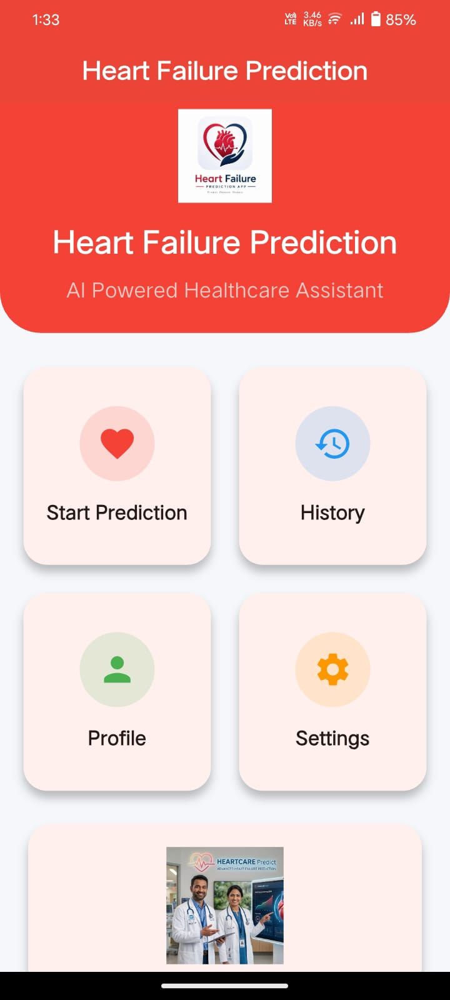

# Heart Failure Prediction App 🫀

A Flutter-based mobile application that predicts the risk of heart failure using Machine Learning. The application provides a simple and user-friendly interface to enter health-related information and receive prediction results.

## Features

- ❤️ Heart failure risk prediction
- 📱 Flutter mobile application
- 🌙 Working dark mode toggle
- 🎨 Improved user interface
- 🚀 Simple and fast user experience
- 🐛 Bug fixes and performance improvements

## Screenshots

### 1. Home Screen

### 2. Patient Information Input Screen (Part 1)

### 3. Patient Information Input Screen (Part 2)

### 4. Prediction Result Screen

### 5. Dark Mode Screen

## Technologies Used

- Flutter
- Dart
- Machine Learning

## Installation

1. Download the latest APK from the Releases section.
2. Install the APK on your Android device.
3. Open the application.
4. Enter required health information.
5. Get the prediction result.

## Version History

### v1.0.1

Updates:
- Updated launcher icon
- Updated application name
- Added working dark mode toggle
- Improved UI
- Fixed bugs

### v1.0.0

Initial release:
- First version of the application
- Basic heart failure prediction functionality

## Future Improvements

- Improve prediction accuracy
- Add more health parameters
- Improve user experience
- Add cloud-based prediction support

## License

This project is developed for educational and research purposes.
